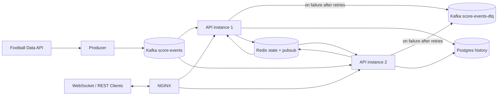

# LiveScore Hub

Distributed live scoreboard backend designed as a portfolio-grade architecture exercise.

This project demonstrates how to build a real-time, fault-tolerant event pipeline with Kafka, Redis, NestJS, WebSocket fan-out, NGINX load balancing, and PostgreSQL history.

## Recruiter TL;DR

- Built an event-driven system with horizontal API scaling and real-time updates.
- Implemented reliability controls usually expected in production systems:
  - idempotency with unique eventId
  - explicit Kafka offset commit
  - retry + DLQ for poison messages
  - graceful shutdown for consumer safety
  - stale-event protection in cache updates
- Integrated real external football data (World Cup API) with simulated fallback mode.
- Validated failure scenarios end-to-end (duplicate replay, stale event, redelivery after restart, cache recovery).

## Why This Project Matters

Live score products are a classic high-read, event-heavy workload. This implementation focuses on the non-trivial parts recruiters care about:

- consistency under reprocessing/rebalances
- near-real-time fan-out to WebSocket clients across multiple API instances
- graceful degradation with external dependencies
- clean separation of hot path (Redis) vs history/audit path (Postgres)

## Architecture



## Core Technical Decisions

### 1) Kafka over RabbitMQ for this use case

Reasoning:
- partitioned event stream gives ordered processing by match key
- replay/reprocessing model fits live-feed recovery and audit
- consumer groups simplify horizontal scale

Trade-off:
- more operational complexity than simpler queue brokers

### 2) Redis as hot state + pub/sub fan-out

Reasoning:
- GET /matches and WebSocket snapshots need low-latency reads
- pub/sub ensures clients connected to any API instance receive updates consumed by any instance

Trade-off:
- pub/sub is ephemeral; durable history is delegated to Postgres

### 5) WebSocket strategy: Redis pub/sub over sticky sessions

Decision:
- avoid session affinity as a correctness dependency for real-time delivery
- use Redis pub/sub to broadcast updates cluster-wide to all API instances

Reasoning:
- with sticky sessions only, clients connected to instance B may miss events consumed by instance A
- pub/sub decouples Kafka consumer assignment from WebSocket connection placement

Trade-off:
- sticky sessions are simpler operationally but weaker for cross-instance consistency
- pub/sub adds infrastructure dependency but improves delivery guarantees in horizontal scale

### 3) Postgres for durable event history

Reasoning:
- queryable timeline for match history endpoint
- persistence source of truth independent from cache churn

Trade-off:
- write path complexity increases due to consistency concerns

### 4) Explicit reliability controls on the consumer

Implemented:
- synchronous persistence before cache/pub-sub
- unique eventId idempotency guard in database
- retry with bounded attempts and DLQ handoff
- manual offset commit only after critical path success
- stale-event rejection in Redis updates
- graceful shutdown with consumer stop before disconnect

## Feature Highlights

- Real-time REST + WebSocket scoreboard updates.
- External API mode and simulation mode.
- Topic auto-creation with 4 partitions and 24h retention.
- Structured JSON logging for producer and consumer lifecycle events.
- Dependency health endpoint with Redis, Postgres, and Kafka checks.

## Endpoints

REST:
- GET /health
- GET /matches
- GET /matches/:id
- GET /matches/:id/history

WebSocket (Socket.IO):
- outbound event: matches:snapshot (on connect)
- outbound event: score:updated (live updates)

Gateway entrypoint:
- http://localhost:3000

## Reliability Validation Evidence

The following scenarios were executed and passed:

1. Duplicate event replay
- same eventId published twice
- database persisted exactly one row for that eventId

2. Stale event regression
- sent minute 60 then stale minute 20 for same match
- Redis state remained at minute 60
- stale skip warning emitted

3. Simulated cache-loss between durable write and cache state
- durable row confirmed in Postgres
- Redis key removed to simulate lost cache state
- same event redelivered without DB duplication
- Redis state rebuilt from redelivery

4. Redelivery after API restart and consumer rebalance
- consumer reconnected after restart
- global check: COUNT(*) == COUNT(DISTINCT eventId)
- no duplicate persistence from replay/rebalance

5. Distributed fan-out readiness
- both API instances subscribed to Redis score-updates channel
- Redis PUBSUB NUMSUB score-updates reported 2 subscribers

## Quick Start

Prerequisites:
- Docker Desktop (or Docker Engine + Compose)

Run:

```bash
docker compose up -d --build
```

Scale API to 2 instances explicitly (local validation mode):

```bash
docker compose up -d --scale api=2
```

Health check:

```bash
curl http://localhost:3000/health
```

Stop:

```bash
docker compose down
```

Reset all data (including Postgres volume):

```bash
docker compose down -v
```

## Environment Variables

From .env.example:

- WORLD_CUP_API_TOKEN=
- USE_REAL_API=true
- WORLD_CUP_POLL_INTERVAL_MS=15000
- WORLD_CUP_API_URL=https://api.football-data.org/v4

Behavior:
- If USE_REAL_API=true and WORLD_CUP_API_TOKEN is valid, producer emits real World Cup events.
- If token is missing/invalid or polling fails, producer falls back to simulated ticks.

## Repo Structure

- api: NestJS application (REST, WebSocket, consumer, health, persistence)
- producer: TypeScript Kafka producer (real API + simulation)
- nginx: reverse proxy and load balancing
- docker-compose.yml: full local distributed stack

## What Is Out of Scope (intentional)

- authentication and authorization
- frontend framework implementation
- kubernetes deployment
- full observability stack (Prometheus/Grafana)

## Next Evolution Steps

- move from TypeORM synchronize to explicit migrations
- add integration tests for failure windows around commit/persist/cache boundaries
- add metrics and dashboards (consumer lag, DLQ rate, cache hit ratio)
- add chaos tests for broker and network instability

## Interview Talking Points

- How idempotency and explicit offset commit were combined to prevent duplicates.
- Why Redis pub/sub was chosen for cross-instance WebSocket propagation.
- Why persistence happens before cache update and how stale state regression is blocked.
- How DLQ strategy protects throughput from poison messages.
- Trade-offs between operational simplicity and reliability guarantees.

## Definition of Done

- [x] Full stack starts with Docker Compose (Kafka, Redis, Postgres, API x2, NGINX, Producer).
- [x] Kafka topic score-events configured with 4 partitions and 24h retention.
- [x] Consumer group scoreboard-group processes events and updates Redis state.
- [x] WebSocket fan-out works across two API instances via Redis pub/sub.
- [x] REST endpoints return current match state and history.
- [x] Resilience controls in place: retries + DLQ, graceful shutdown, explicit commit, idempotency by eventId.
- [x] Failure validations executed: duplicate replay, stale event regression, redelivery after restart/rebalance.
- [x] Architecture decisions documented with trade-offs.
